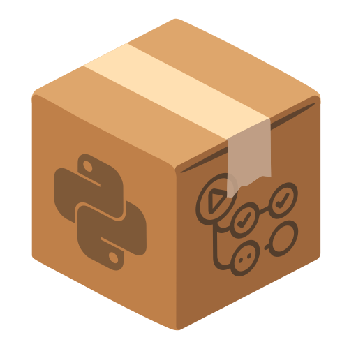

<p align="center">
    
    <h3 align="center">Cookiecutter PyAction</h3>
    <h6 align="center"><a href="https://github.com/cookiecutter">@cookiecutter</a> template for writing GitHub Actions in Python :cookie:</h6>
</p><br>

Use this template to create [Custom GitHub Actions](https://docs.github.com/en/actions/creating-actions/about-custom-actions) in Python. By default, GitHub only supports the following implementations.

* Composite Action
* Docker Container
* JavaScript

`cookiecutter-pyaction` template is a simple Python-supported implementation over the "Docker Container" type. Follow the steps and make your action in a flash! :zap:

### Installation
Make sure you have Python and `pip` installed on your machine and install the `cookiecutter` package. That's the template generator tool.

```sh
pip install -U cookiecutter
```

### Usage
In order to create the template, change the directory to the desired path and run the following command.

```sh
cookiecutter gh:lnxpy/cookiecutter-pyaction
```

Keep answering the prompt and your template will be generated.

> Note: If you want to publish your action in the [GitHub Marketplace](https://github.com/marketplace), make sure to choose a unique name for you action.

### Contribution
All your contributions and assistance are welcome. For more information about how you can contribute to the project, please follow the steps [here](CONTRIBUTING.md). :beers:

### License
Cookiecutter PyAction is licensed under the terms of [MIT License](LICENSE).
