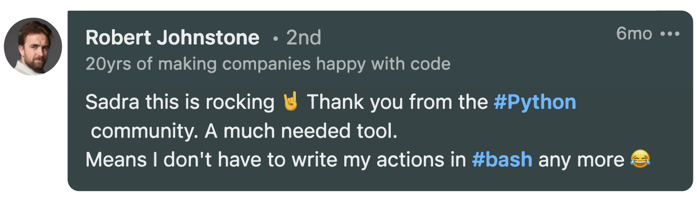

PyAction is a [:simple-cookiecutter: Cookiecutter](https://cookiecutter.io) template that allows you to develop custom [:simple-githubactions: GitHub Actions](https://docs.github.com/en/actions) using [:simple-python: Python](https://python.org/). This documentation covers the basics and a [Hello-world demo](demo.md) example action.


## Easy to Setup
Make sure you have `pip` installed on your machine and install the `cookiecutter` package.

```
pip install cookiecutter
```

Now, execute the following command and initialize a basic action template.
```
cookiecutter gh:lnxpy/pyaction
```

Follow the prompting and provide yourself a nicely put-to-gether action template.

Here you can see a very basic hello-world example action generated with PyAction. For a more detailed example, check out the [Hello-world demo](demo.md).

=== "main.py"

    ``` py
    import os
    import sys
    from typing import List

    from actions import io


    def main(args: List[str]) -> None:
        """main function

        Args:
            args (list[str]): STDIN arguments
        """

        name = os.environ["INPUT_NAME"] #(1)

        io.write_to_output(
          {
            "phrase": f"Hi {name}!" #(2)
          }
        )


    if __name__ == "__main__":
        main(sys.argv[1:])
    ```

    1.  This is how we read the input parameters from `with` statement in `.github/workflows/main.yml`:

        ```yaml hl_lines="4" title=".github/workflows/main.yml" linenums="1"
        steps:
          - uses: you/your-action
            with:
              name: John
        ```

    2.  Here is how we return data to the workflow, store it as an environment variable, and use it as input for other steps of the workflow.

        ```yaml hl_lines="2 6 10" title=".github/workflows/main.yml" linenums="1"
        steps:
          - id: greetings
            name: Using your-action
            uses: you/your-action
            with:
              name: John

          - name: Echo message
            run: |
              echo ${{ steps.greetings.outputs.phrase }}
        ```

=== "action.yml"

    ``` yaml
    name: Greetings Action
    description: This action greets whoever runs it
    author: John Doe

    branding:
      icon: check
      color: blue

    runs:
      using: docker
      image: Dockerfile

    # == inputs and outputs ==

    inputs:
      name:
        required: false
        description: the person/thing you want to greet
        default: World

    outputs:
      phrase:
        description: output variable
    ```


## How It Works
Custom GitHub Actions can be developed in different ways. PyAction uses the [Docker Container](https://docs.github.com/en/actions/creating-actions/about-custom-actions#docker-container-actions) method which is highly stable with different Python environments. This way, you'll be able to specify the requirements for your actions and run them inside a lightweight isolated container with all the dependencies installed.

## Passion
As a Python developer, I always wanted to help the community and be impactful in its growth. Watching that GitHub supports JavaScript as an official method for creating actions, made me think of inventing a way for Python developers to help the community be able to write actions in Python and benefit from the powerful packages and tools from Python's world.

Months before PyAction, I had lots of ideas to develop and publish as actions. Since most of them were quite dependent on Python packages, I had no choice but to implement the whole thing and provide a Python environment for my action to be able to make use of those packages.

<figure markdown="span">
  { width="550" }
  <figcaption><a href="https://www.linkedin.com/in/robert-arthur-johnstone/">@Robert-Johnstone</a> on LinkedIn</figcaption>
</figure>

Sharing the idea on the socials like LinkedIn and receiving lovely supportive messages like Robert's, truly cheered me up and was quite a motivation for me. :orange_heart:

After some trials and errors, I came up with a structure that was working fine. It was able to interact with my workflow pipeline, write to it, and retrieve data from it.

I put it to test and implemented some real-world actions to test its limits and functionalities. Finally, some developments passed by and the template was ready to be publicly used by others.

## Next Steps
I'm planning to expand PyAction's features and availability in other languages. Also trying to keep it up to date with the official changes that GitHub fellows make over on the GitHub Actions infrastructure.

If you're interested in the idea, your contribution is welcome as always. Check out the [Contribution Guide](contributing.md) for more information.
