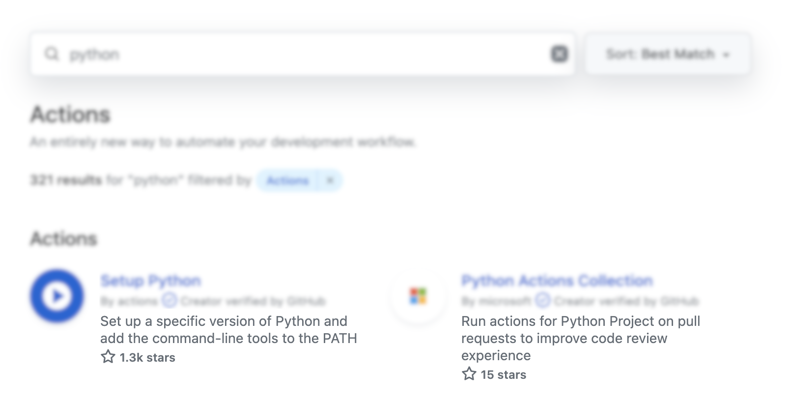

# Welcome to PyAction Cookiecutter
PyAction is a [Cookiecutter](https://cookiecutter.io) template that allows you to develop GitHub Actions using Python language. This documentation covers a fundamental overview about the project, a hello-world example, and the key notes you need to remember if your want to push your action to the [GitHub Marketplace](https://github.com/marketplace).

## Introduction
Custom GtiHub Actions can be made in the following ways.

* Docker-based Actions
* Javascript Actions
* Composite Actions

PyAction is based on the Dockerfile implementation that GitHub recommends and has some workflow-related features that allow you to have access to the variables and data transferring during your workflow run.

!!! Note
    For more information about the theory behind PyAction, I've written [Writing GitHub Actions in Python](https://imsadra.me/writing-github-actions-in-python) article that gives you an accurate perspective that you can follow and find more about.

## Installation
The first step is to install the `cookiecutter` package on your machine.

```bash
pip install -U cookiecutter
```

To ensure that the installation process was successful, check out the installed version with `-V` flag.

```bash
cookiecutter -V
```

## Usage
Now, it's time for the template generation. Easily do this via the following command and after a few promptings, you'll have your very first action generated there.

```
cookiecutter gh:lnxpy/cookiecutter-pyaction
```

In the next section, we'll be taking a look over each question that's being asked and the proper answere you can give on each question.

### Promting
These are the questions that by answering them, you'll have the most suited action for your case.

#### `Action name`
The name that you choose from your action.

!!! Warning
    If you're planning to push your action to the GitHub Marketplace, make sure that the _slugged_ version of your action name is unique. To check if it's unique, make sure the following URLs lead you to 404.

    * https://github.com/marketplace/actions/[slugged-action-name]
    * https://github.com/[slugged-action-name]
    * https://github.com/orgs/[slugged-action-name]

#### `Project slug`
Slugged version of your action name. The best option is to leave it as how it is by default.

#### `Description`
A short description for your action. This description will be shown in the marketplace index of your action.

<figure markdown>
  { width="700" }
  <figcaption>This is where GitHub puts your action description</figcaption>
</figure>

#### `Author name`
The action's author name. You can put your both first name and last name together.

#### `Email address`
Your email address.

#### `GitHub username or organization`
Your GitHub username or organization.

#### `Starting version`
The beginning version of your action.

#### `Open source license`
Chose an open-source license or `notopensource` if your action is not open-source.

#### `Python version`
The Python version that you want to use in your action. Both Python3.X and Python2.X are supported.

#### `Include dependencies`
Answer `y` if your action has some additional dependencies. What does option does is that it creates a `requirements.txt` file and installs the requirements before the action execution.

#### `Include badges in readme`
If you want to show  and  badges on your action's README page, then answer `y` to this question.

#### `Branding icon`
Branding icon comes in handy when you want to publish your action in the marketplace. It's basically the icon that's shown as your Action icon. Check out [Feather](https://feathericons.com/) for the available icons that you can use.

#### `Branding color`
Choose a color for your branding icon.

#### `Publish in the marketplace`
This field only shows a warning message about your `Action name` and ensuring that you've chose a unique name.

!!! Warning
    Please keep in mind that I'm trying to make the generation phase easier and faster so I'll be changing some of the promps and dropping some of them with the aim of simplicity. :zap:
